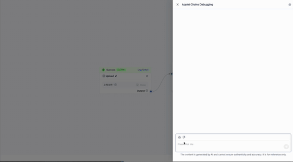

# sophonParser-demo

An Integrated Toy Parser for PDF/DOC/EXECEL/PPTX.

| **`Linux/Mac OS`** | **`Windows`** | **`Coverage`/`Test` ** |
|-----------------|-------------|------------|
| ✅ | ✅ | TODO |


| Field | Value |
|-------|-------|
| Author | yfyang.86@hotmail.com |
| Version | 0.1.0 |
| License | Apache 2.0 |
| Status  | Developing | 

## Show case:



## Usage

### SDK

Prepare the `configure.json` file, and run 

```python
import doc_parser
import base64
your_pdf_file = '...'
parser = doc_parser.SophonParser("configure.json")
with open('test.pdf', 'rb') as f:
    pdf = base64.b64encode(f.read()).decode()
    print(parser.parse(your_pdf_file))
```

Notive, we use VLM to parse the pdf. The API should follow the following style:

```json
{ 
        "model": "atom",  
        "stream": false, 
        "messages": [ {
            "role": "user",
            "content": [ {
                "text": "system_prompts",
                 "type": "text"}, 
                 { "type": "image_url", 
                  "image_url": {
                      "url": "data:image/jpeg;base64,IMG_BASE64_DATA"}}]
                  }]}
```

If you have different API, make sure:

- input: In `utils.py`, modify `callvlm()` function accordingly.
- output: In `doc_parser.py`, modify `content = response_data['choices'][0]['message']['content']` in `parse_pdf()` accordingly.
  
### A Simple flask Server

To use the server mode, you can use the following command:

```sh
git clone https://github.com/yfyang86/sophonParser-demo
cd sophonParser-demo
python server.py
```

## Output

- Page: Page/Chunk number
- Text: HTML/Markdown Text
- Table: HTML Table
- Figures: Image Base64

Example:

```json
[
{
"page": 1,
"text": null,
"table": [
"

\n\n\n\n\n\n\n\n\n\n\n\n\n\n\n\n\n\n
demo	example
2asd	123
2313	1
sd	0
"
],
"figures": null
},
{
"page": 2,
"text": null,
"table": [
"\n\n\n\n\n\n\n\n\n\n\n\n\n\n\n\n\n\n
operation	parames
x	s
x	s
x	s
"
],
"figures": null
}
]
```

## Eaxmple


## Install

### Requirements

Python: 3.8+ (tested on 3.10.10)

Pypi:

```sh
git clone https://github.com/yfyang86/sophonParser-demo
cd sophonParser-demo
python -m pip install -r requirements.txt
python -m pip install -e .
```

Extra:

- `unoconv` and `libreoffice` for converting DOC/XLS/PPT to PDF

### Demo configuration

```json
{
    "vlm_api_url": "url_qwen2_vlm",
    "vlm_api_key": "some_api_key",
    "system_prompts": "使用markdown语法，将图片中识别到的文字转换为markdown格式输出。你必须做到：\n1. 输出和使用识别到的图片的相同的语言，例如，识别到英语的字段，输出的内容必须是英语。\n2. 不要解释和输出无关的文字，直接输出图片中的内容。例如，严禁输出 “以下是我根据图片内容生成的markdown文本：”这样的例子，而是应该直接输出markdown。\n3. 忽略掉长直线、忽略掉页码。\n再次强调，不要解释和输出无关的文字，直接输出图片中的内容。",
    "DEFAULT_PROMPT": "使用markdown语法，将图片中识别到的文字转换为markdown格式输出。你必须做到：\n1. 输出和使用识别到的图片的相同的语言，例如，识别到英语的字段，输出的内容必须是英语。\n2. 不要解释和输出无关的文字，直接输出图片中的内容。例如，严禁输出 “以下是我根据图片内容生成的markdown文本：”这样的例子，而是应该直接输出markdown。\n3. 忽略掉长直线、忽略掉页码。\n再次强调，不要解释和输出无关的文字，直接输出图片中的内容。",
    "DEFAULT_RECT_PROMPT": "图片中用带颜色的矩形框和名称(%s)标注出了一些区域。如果区域是表格或者图片，使用  的形式插入到输出内容中，否则直接输出文字内容。",
    "DEFAULT_ROLE_PROMPT": "你是一个PDF文档解析器，使用markdown和latex语法输出图片的内容。",
    "RapidLayout_model_type": "pp_layout_cdla",
    "flask_host": "0.0.0.0",
    "flask_port": 9010
}
```

## Related Projects

- PDF parser: Qwen2.5-VLM servring as the PDF parser.
- PDF Layout: `rapid_layout` [module](https://github.com/RapidAI/RapidLayout). The available model could be  `pp_layout_cdla` among many others.
- DOC/XLS/PPT Converter: Binary tools from [LibreOffice](https://www.libreoffice.org/).
- DOC/XLS/PPT Parser: `docx`, `openpyxl`(`xlsxhtml`), and `pptx` modules
- Server: Flask serving as the server.
